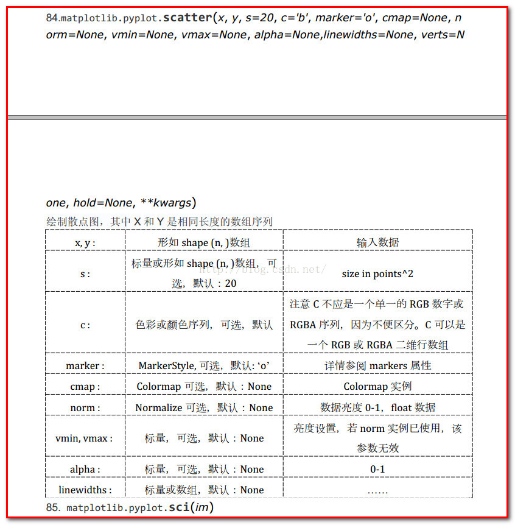

# matplotlib

- 什么是探索性数据分析
- Python常用的可视化工具
- 探索变量关系及其可视化
- 3D绘图
- 项目案例：Lending Club借贷数据探索性分析及可视化

## 什么是探索性数据分析 (EDA)
- EDA 常用工具--基于图形的量化技术
    - 散点图 scatter  
matplotlib.pyplot.scatter(x, y, s, c, marker...)  

    - 直方图 hist
matplotlab.pyplot.hist(x, bins)
    - 柱状图 bar  
matplotlib.pyplot.bar(left, height, alpha, width, color, edgecolor,label)
    - 线形图
    - 盒装图
    - 矩阵绘图 plt.imshow()

## python  常用的可视化工具

- matplotlib
绘图接口，import matplotlib.pyplot as plt
- figure
1：matplotlib 的图像均位于figure对象中
2：创建figure：plt.figure()
- Subplot
1：figure.add_subplot(a, b, c)
2：a，b表示将figure分割成a*b的区域，c表示要操作的区域，注意：从11开始编号

### 刻度、标签、图例
- 设置度范围
    - plt.xlim(),plt.ylim()
    - ax.set_xlim(),ax_set_ylim()
- 设置显示的刻度
    - plt.xticks().plt.yticks()
    - ax.set_xticks(),ax.set_yticks()
- 设置刻度标签
    - ax.set_xticklabels,ax.set_yticklabels()
- 设置坐标轴标签
    - ax.set_xlabel(),ax.set_ylabel()
- 设置标题
    - ax.set_title()
- 图例
    - ax.plot(label='legend')
    - ax.legend(),plt.legend()

### 代码操作
- 引入matplotlib 包 ，import matplotlib.pyplot as plt
- figure 
```python
# hist 表示直方图，其中的prama color表示填充颜色，alpya 表示不透明度
plt.hist(np.random.randn(100), bins=10, color='r', alpha=0.5)
plt.show()
```
```python
fig, ax = plt.subplot(1)
ax.plot(np.random,randn(1000).cumsum(), label='line0')

# 设置刻度范围
ax.set_xlim([0, 800])
# 设置显示刻度
ax.set_xticks(rang(0,500,100))
# 设置刻度标签
ax.set_xlabel('Number')

```


# Seaborn