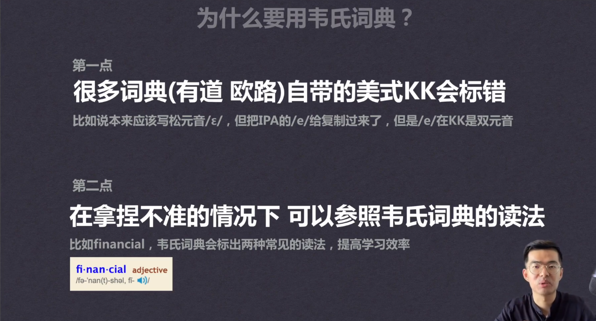
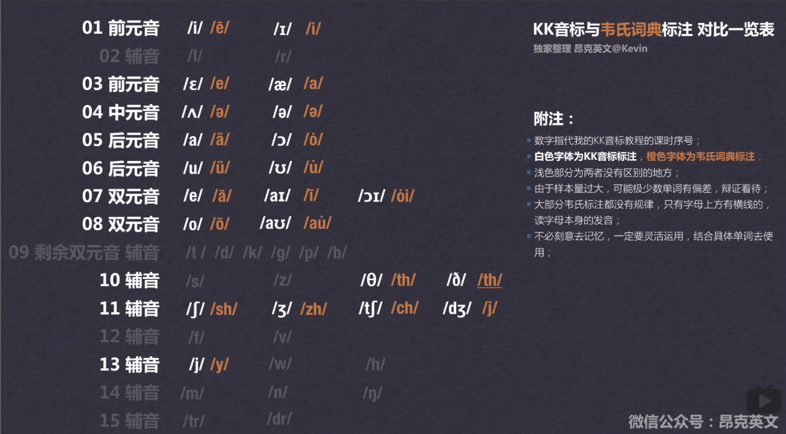

# 一节课学会韦氏发音
> Time:2019-7-8  
WebSite:https://www.bilibili.com/video/av57457996

# 什么是韦氏词典？
美国人Native Speaker使用的词典，对于音标的标识与平常的不一样，他们会使用自己熟悉的东西来表示。
# 为什么要用韦氏词典？

- 第一点
很多词典（有道，欧陆）自带的没事KK会标错，比如说本来应该写松元音// ,但是把IPA的/e/给复制过来了，但是/e/在KK是双元音。
- 第二点
在拿捏不准的情况下可以参照韦氏词典的读法，比如financial，韦氏词典标出了两种常见的读法，提高学习效率。
# 怎么高效使用韦氏词典？
- “听”完再“看”
听小喇叭的实际发音，看韦氏单词的标注  
- 怎么看？
如何把KK发音和韦氏词典的标注对应起来？

# 如何将韦氏词典添加到欧陆词典中？
百度网盘资源，附使用说明。  

链接：https://pan.baidu.com/s/1OoIUhldj1lhEltAYYtIXhQ   
提取码：qpd7   
复制这段内容后打开百度网盘手机App，操作更方便哦  