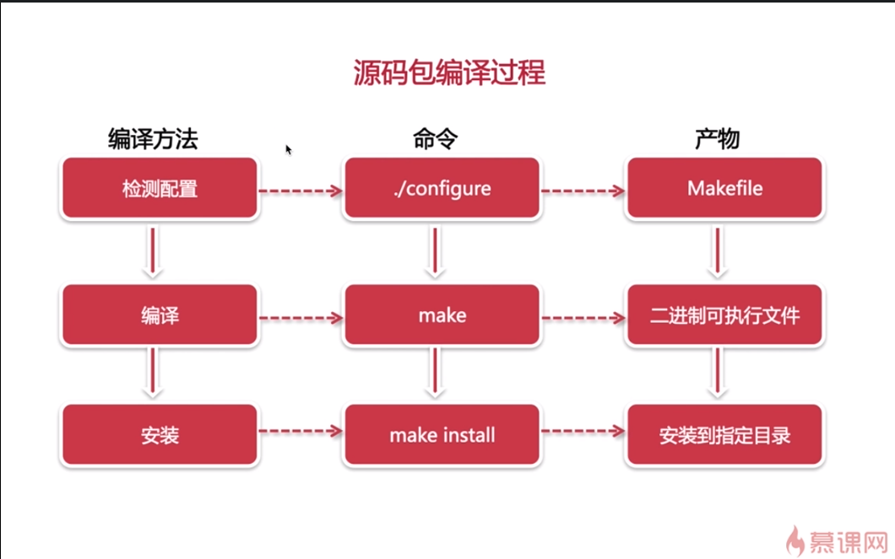

# Linux系统扫描和安全防范

# 源码包的编译过程

简单来说就是使用./configure 检测本机的配置是否可以安装，执行命令后生成Makefile，使用make命令编译Makefile，可得到一个二进制可执行文件，之后使用make install 进行安装。  
# 主机扫描技术

## fping
```
fping - send ICMP ECHO_REQUEST packets to network  hosts  
fping is a program like ping which uses the internet Control Message Protocol(ICMP) echo request to determine if a target  host is responding.fping is differs from in that you can specify any number of target on the command line,or specify a file containing the list of target to ping.
```
### 安装
1、下载fping的源码包，官方网站为：http://fping.org/  
2、解压后进入该目录  
3、进行源码包安装过程  

### fping命令和参数详解
Usage：fping [options] [targets]  
用法：fping [选项] [ping的目标]  
-a 显示可ping通的目标，表示主机存活  
-u 显示不可ping通的目标，表示目标主机没有存活  


## hping

### 安装
1、源码包下载，下载地址 http://www.hping.org/  
2、`./configure--->make---->make install`(hping依赖libpacp-devel)  
3、可能在安装的过程中会遇见错误  

- 报错1：
```
libpcap_stuff.c:19:21: error: net/bpf.h: No such file or directory
make: *** [libpcap_stuff.o] Error 1
```  
解决办法：ln -sf /usr/include/pcap-bpf.h /usr/include/net/bpf.h  
- 报错2：
```
al/lib -lpcap  -ltcl -lm -lpthread
/usr/bin/ld: cannot find -ltcl
collect2: ld returned 1 exit status
make: *** [hping3] Error 1
```
解决办法：yum -y install tcl tcl-devel
- 报错3
```
gcc -c -O2 -Wall    -g  main.c
main.c:29:18: 致命错误：pcap.h：没有那个文件或目录
 #include <pcap.h>
                  ^
编译中断。
make: *** [main.o] 错误 1
```
解决办法；
```
yum install  -y   libpcap-devel
yum install  -y   tcl tcl-devel
```

# 路由扫描技术

## traceroute
### 操作
## mtr


# 批量服务扫描技术

## nmap

## ncat

# 预防恶意的扫描和攻击

## 1、SYN攻击

## 2、DDOS攻击

## 3、恶意攻击
----------------------
tracert
nmap
nc

主机扫描
fping 批量ping相应主机
-a 存活的主机
-u 没有存活的主机
-g 主机段
-f fping一个文件，里面保存了主机抵质

hping
-p 

路由扫描  
查询一个主机到另外一个主机的经过的路由的跳数，及数据延迟情况。  
traceroute mtr  
-T -p -I -n

nmap ncat
ping 扫描
TCP 半扫描
TCP 全扫描
UDP扫描

wzv