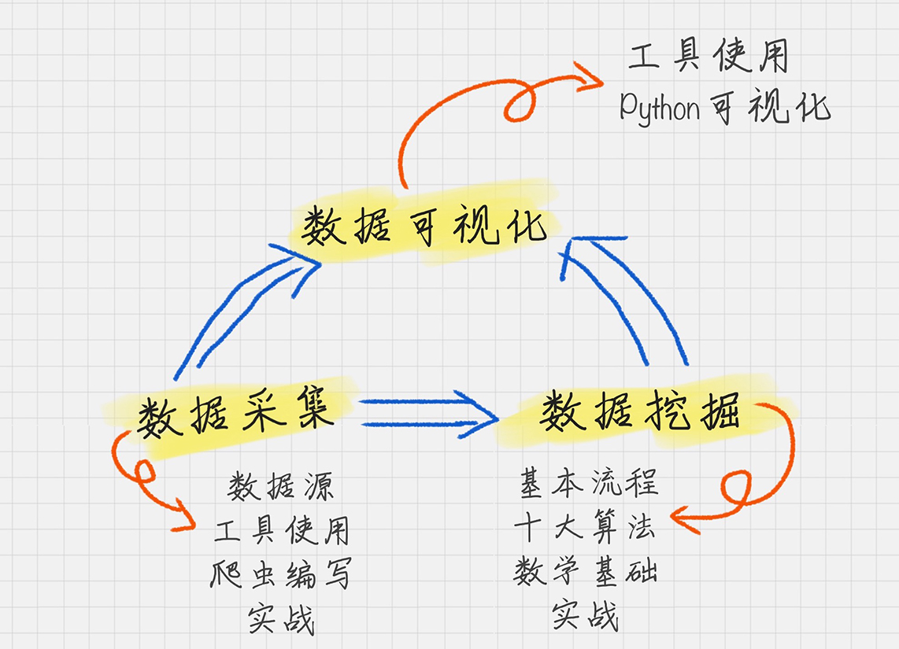
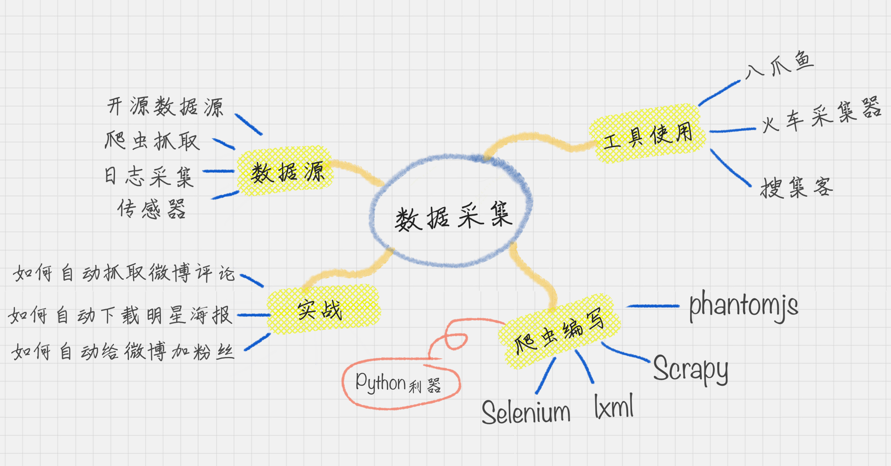
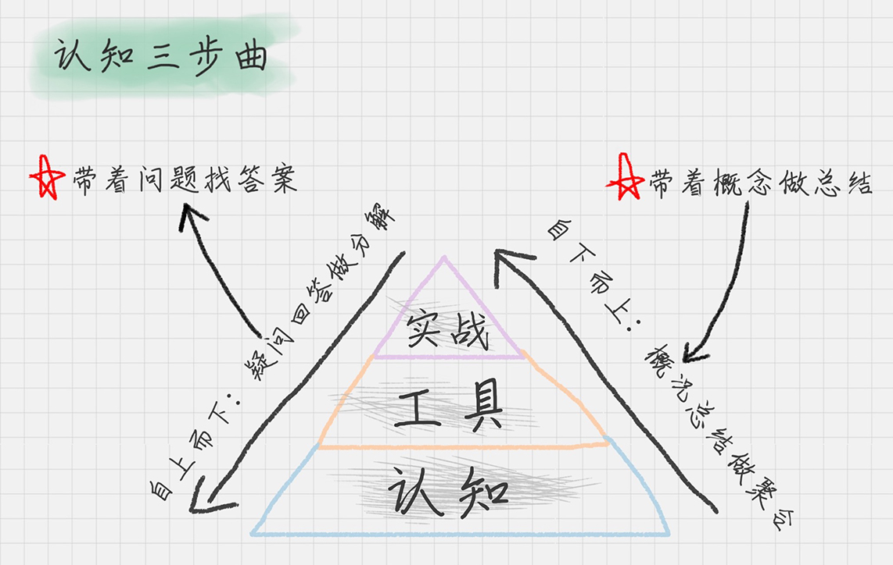

# 01 | 数据分析全景图及修炼指南
> 时间：2019-7-15  
> 地址：https://time.geekbang.org/column/article/73270  

# 谈论数据分析时，都在讲什么？
1、数据采集。它是我们的原材料，也是最接地气的部分，因为任何分析都要有数据源。  
2、数据挖掘。它可以说是最高大上的部分，也是整个商业价值所在。之所以要进行数据分析，就是要找到其中的规律，来指导我们的业务。因此数据挖掘的核心就是挖掘数据的商业价值，也就是我们所说的BI商业智能。  
3、数据可视化。他可以说是数据领域的万金油的技能，可以让我们直观的了解到数据分析的结果。  

## 数据采集

## 数据挖掘
  

## 数据可视化
- 使用python
matplotlib，Seaborn
- 使用第三方工具
微图，DataV等第三方工具

我认为学习数据分析最好的方法是：在工具中灵活运用，在项目中加深影响。  

# 修炼方法
我们只有把知识转化成自己的语言，他才真正变成我们自己的东西。
  
如果说认知是大脑，那么工具就好比是我们的双手。  
牢记如下原则：
- 不重复造轮子
- 工具决定效率

# 总结
大概的学习了一下数据分析的几个部分，从数据获取到数据挖掘，再到数据可视化，以及其中的关系，说明了三者的关系，再到知识的大概了解，例如：数据采集，可以采用工具八爪鱼，也可以编写Python爬虫来获取。数据挖掘，就是算法的累计。数据可视化，展现数据的一种形式。最后就是认知，学习上的两个原则，不重复造轮子，工具的重要性。