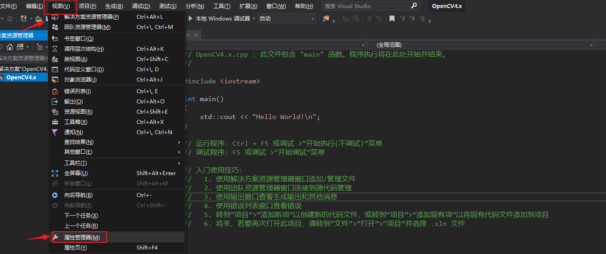
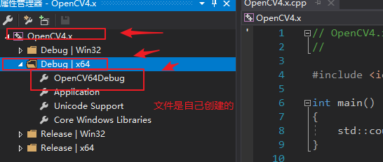
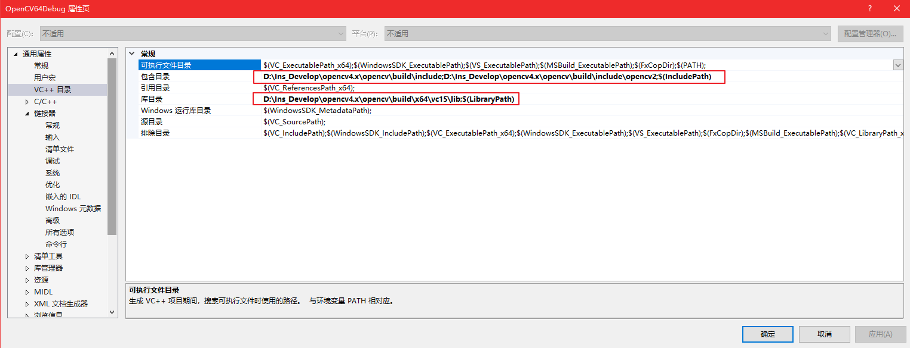
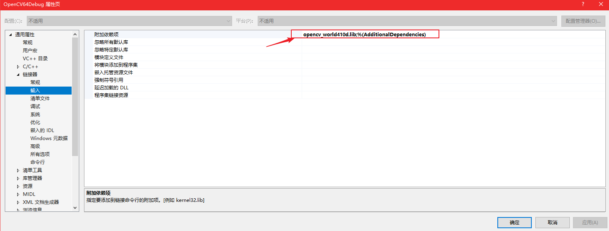

# VS2017配置opencv教程


# 前言
时间；2019-7-18  
环境：Visual Studio 2019，Windows，OpenCV 4.1.0  

# 说明
也许读者也看过其他配置OpenCV的教程，但是创建的项目属性下面没有一个叫Microsoft.Cpp.x64.user的文件，这里我使用其他的方法配置。  

# OpenCV配置步骤
1、下载OpenCV，官网为opencv.org，我使用的是OpenCV4.1.0  
2、安装opencv，建议选择其他盘符，我的安装目录为：D:\Ins_Develop\opencv4.x  
3、将opencv添加到环境变量，在path中添加：D:\Ins_Develop\opencv4.x\opencv\build\x64\vc15\bin  
4、将D:\Ins_Develop\opencv4.x\opencv\build\x64\vc15\bin 目录下的opencv_world410.dll，opencv_world410d.dllopencv_ffmpeg341_64.dl文件复制到C:\Windows\System32  

# Visual Studio 2019 配置
1、在VS 2019 中创建一个控制台应用，之后按照步骤执行即可，并修改使用Debug位数。  
  

2、找到Debug | X64，创建属性表，并双击。  

  
3、  
(1):将D:\Ins_Develop\opencv4.x\opencv\build\include 和 D:\Ins_Develop\opencv4.x\opencv\build\include\opencv2 配置到到 VC++目录下的包含目录  
(2):将D:\Ins_Develop\opencv4.x\opencv\build\x64\vc15\lib配置到VC++目录下的库目录   
  
4、设置 链接器-->输入-->附加依赖项 值为opencv_world410d.lib


# 测试
```C++
//建立一个C++控制台程序，添加OpenCV4.x.cpp : 此文件包含 "main" 函数。程序执行将在此处开始并结束。
// #include "pch.h"

#include <iostream>
#include <opencv2/highgui.hpp>
#include <opencv2/core.hpp>
#include <opencv2/imgcodecs.hpp>

using namespace cv;
using namespace std;

int main()
{
	Mat image;
	image = imread("E:\\Data_Media\\Data_Picture\\1\\preview4.jpg"); // Read the file

	if (image.empty()) // Check for invalid input
	{
		cout << "Could not open or find the image" << std::endl;
		return -1;
	}

	namedWindow("Display window", WINDOW_AUTOSIZE); // Create a window for display.
	imshow("Display window", image); // Show our image inside it.

	waitKey(0); // Wait for a keystroke in the window

	std::cout << "Hello World!\n";
}
// 运行程序: Ctrl + F5 或调试 >“开始执行(不调试)”菜单
// 调试程序: F5 或调试 >“开始调试”菜单
```
