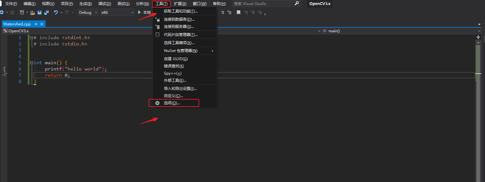
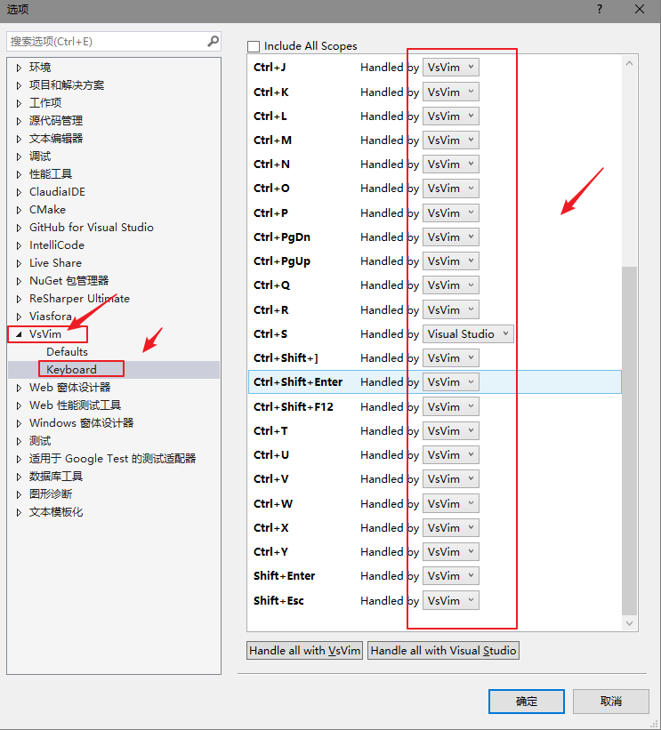
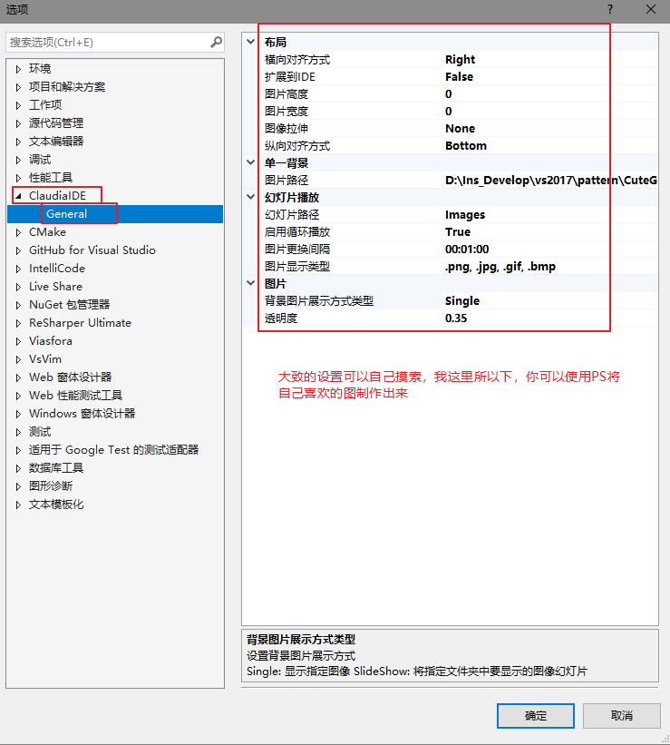
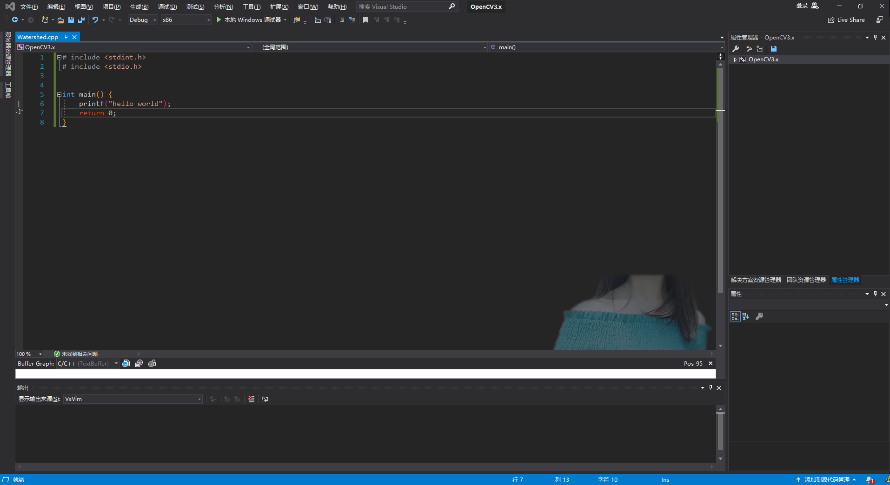

# Visual Studio 2019 插件安装使用

**这里我默认你已经安装好了Visual Studio 2019**

# 安装流程
1、下载.vsix结尾的插件  
2、双击即可安装  
# 插件推荐
## VsVim
用惯了Vim的人肯定知道他的方便，丢掉鼠标的快感，无限装逼，最主要的是能够提高生产力。    
下载地址：`https://marketplace.visualstudio.com/items?itemName=JaredParMSFT.VsVim`   
简单使用：这里你需要根据自己的需求，设置一下快捷键是使用Vim的，还是使用VS原来的。
  
  
Vim的具体操作见我的另外一篇文章。  

## ClaudiaIDE
是一款可以在编辑其中以自己喜欢的图片为background的插件。  
下载地址：`https://marketplace.visualstudio.com/items?itemName=kbuchi.ClaudiaIDE`  
点击工具--->选项----->你会看见ClaudiaIDE的设置界面，可自己摸索。  

# 安装中遇见的问题
- VS一直请求重启？  
那是因为有的人在安装过后想着下次重启，结果没有重启电脑所致，该问题重启电脑即可。  
