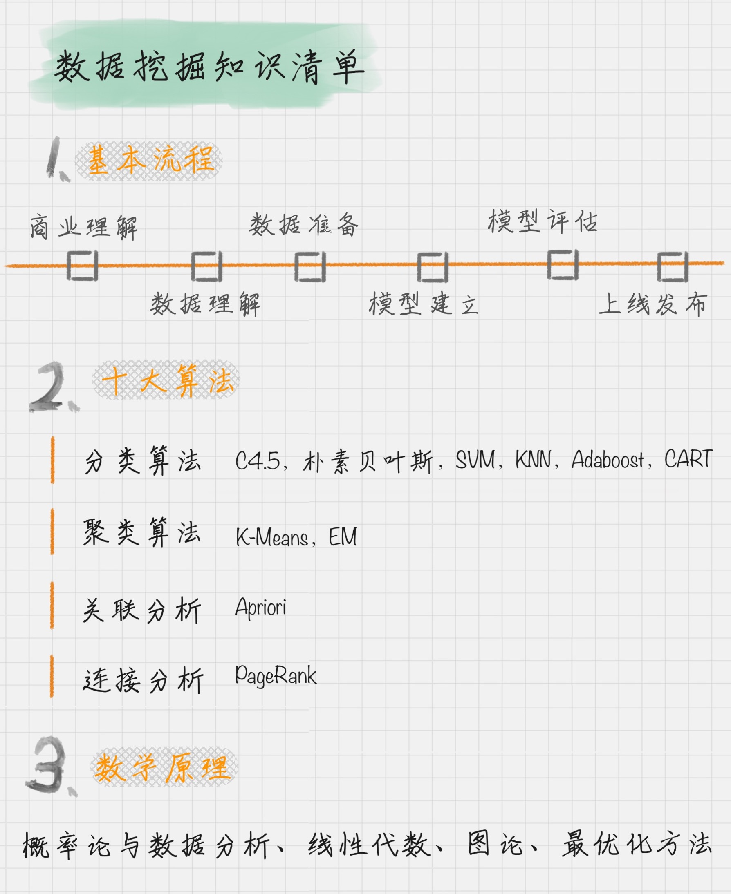

# 02 | 数据挖掘的最佳路径是什么？
> 时间：2019-7-15  
> 地址：https://time.geekbang.org/column/article/73397  

# 数据挖掘，认识清单开始

## 数据挖掘的基本流程
数据挖掘的过程可以分为6个步骤  
1、商业理解：数据挖掘不是我们的最终目的，我们的目的是更好的帮助业务，所以第一步应该从商业的角度理解项目需求，在此基础上对数据挖掘的目的进行定义。  
2、数据理解：收集数据，然后对数据进行探索，包括数据描述，数据质量验证等。  
3、数据准备：开始收集数据，对数据进行清洗、数据集成等操作，完成数据挖掘的前期工作。  
4、模型建立：选择和应用相应的数据挖掘模型，以便更好地分类结果。  
5、模型评估：对模型进行评估，检查模型的每一步骤，确认模型是否满足预定的商业目标。  
6、上线发布

## 数据挖掘的十大算法
数据科学家门提出各种模型，国际权威学术组织ICDM（the IEEE International Conference on  Data Mining）评选出的十大经典算法：  
| 分类算法：C4.5，朴素贝叶斯，SVM，KNN，Adaboost，CART    
| 聚类算法：K-Means,EM  
| 关联分析：Apriori  
| 连接分析：PageRank  

## 数据挖掘的数学原理
| 1、概率论与数理统计  
| 2、线性代数  
| 3、图论  
| 4、最优化方法

# 总结

