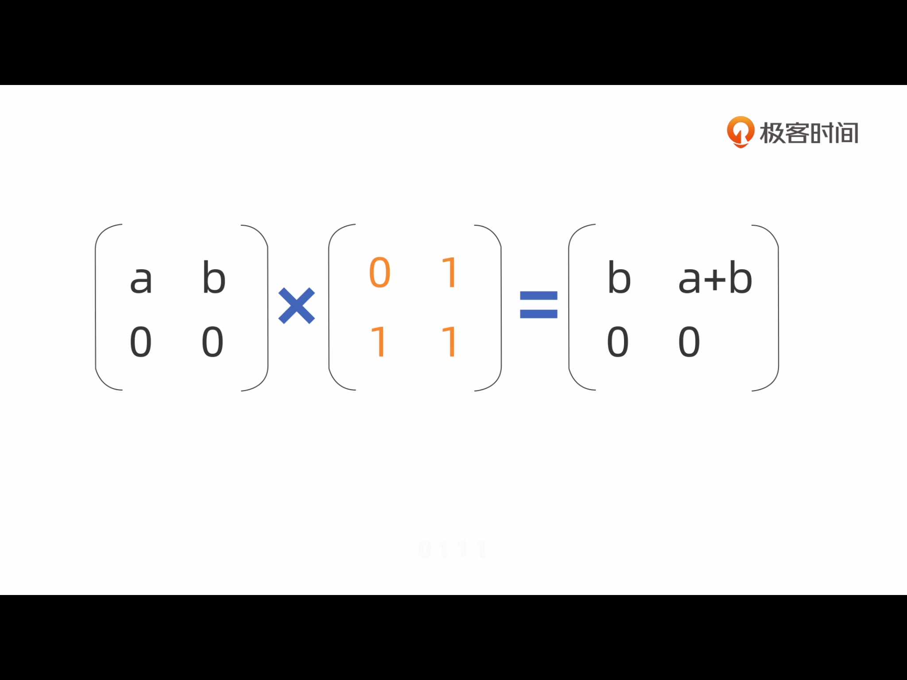

# 如何优雅的计算菲波那切数列？

# 特点
答案简单，区分度高，马甲总多  
0 1 1 2 3 5 8 13 21....  

## 一
```swift
let fibnacci = n =>
    n <=0 ? 0:n==1? 1 : fibnacci(n-2)+finacci(n-1)
```
时间复杂度是 指数级的，在算到n为40的时候，就需要几分钟的时间了，但是可以使用动态规划的思想进行优化,把递归改成迭代    

## 二

```swift
let finacci = n => {
    if(n==0){
        return 0;
    }
    let a1 = 0, a2 = 1;
    for(let i = 1; i<n; i++){
        [a1 ,a2] = [a2, a1+a2];
    }
    return a2;
}
```
时间复杂度是O(n)

## 三
组合数学中，特征方程，母函数....
直接给出结论  
```swift
let finacci = n =>
    (Math.pow((1+Math.sqrt(5))/2, n) - Math.pow((1-Math.sqrt(5))/2, n))/Math.sqrt(5);
```
Math.pow()的时间复杂度可以为 O(log(n))
```swift
let pow = (x, n) =>{
    var r =1;
    var v = x; 
    while(n){
        if(n%2 == 1){
            r *= v;
            n -= 1;
        }
        v = v*v;
        n = n/2;
    }
    return r;
}
```
实现的思路大致就是，将指数n转换成二进制，如果位数是1，则乘以相应次数的倍数。
Math.round()

## 四

矩阵的幂运算实现finacci()，如下




