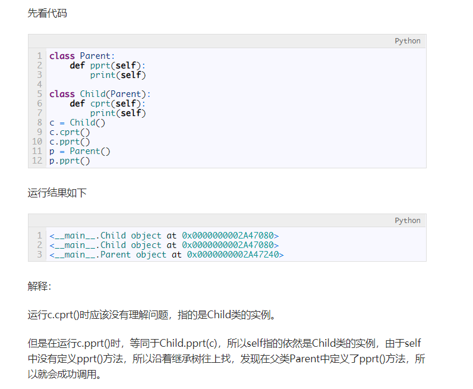

# Mysql 
## Mysql 不是内外部命令?
- 将Mysql安装目录下的bin路径添加到电脑的环境变量中。
## 修改Mysql密码
- set password root@localhost password(“密码”)

# Python
- 1.Python中的self？
    - 	self代表的是类的事例，而self.class则指向类
    - 
- 2.trim()方法？
    - 
- 3.python filter？
    - 
- 4.re.sub()
    - 
- 5.python String 
    - 
- 6.python 启动简单的http服务命令？
    - py2:python -m SimpleHTTPServer 
    - py3:python -m http.server
# Docker
- 1.启动docker服务
    - service docker start
- 2.docker容器和主机进行数据传输  
    将主机./RS-MapReduce目录拷贝到容器30026605dcfe的/home/cloudera目录下。  
    `docker cp RS-MapReduce 30026605dcfe:/home/cloudera`
    将容器30026605dcfe的/home/cloudera/RS-MapReduce目录拷贝到主机的/tmp目录中。  
    `docker cp  30026605dcfe:/home/cloudera/RS-MapReduce /tmp/`
# Daily
- 1.看电脑电池
    - >	1右击开始或者按windows键+X键，单击命令提示符（管理员）。  
	2输入命令：cd %userprofile%\Documents 并回车。  
	3输入命令：powercfg /batteryreport，并回车，回车后会在我的文档中生成一个html文件（battery-report.html）。  
	4找到我的文档，打开battery-report.html文件  

# C/C++ Que
- 1.没有 iostream.h 文件？
    - 

# Git 
- 1.git add . 报错？
    - 
- 2.git 强制提交本地分支覆盖远程分支？
    - 
- 3.git 删除远程关联？
    - 1
- 4.git 放弃没有add到暂存区的修改？
    - git checkout . (. 表示所有的文件，你可以放弃指定的文件)

# Idea 
- 1.步骤
    - 
- 2.注释格式
    - 

# java
- 1.jsp获取根目录？
    - 
# Vim
- 1.查看vim版本
    - 在vim中输入 :version
    - 
# Markdown 
- 1.自动生成文章目录？
    - 博文第一行写一句`@[TOC](文章目录)`
# 