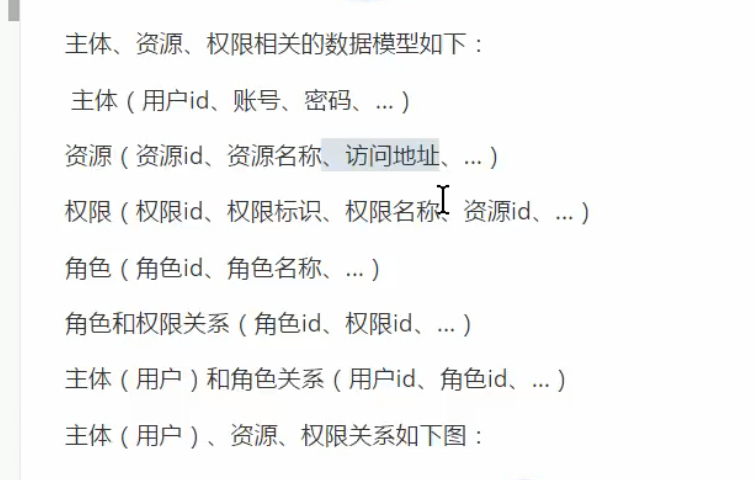
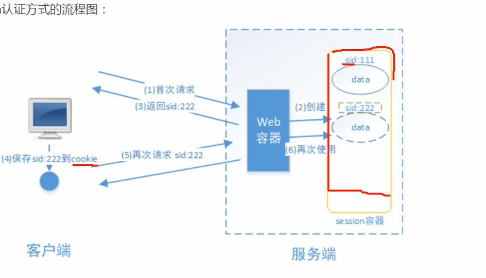

# 1.3 授权的是数据模型
who   主体
what 
how

## 数据资源 功能权限

# 1.3.1 RBAC

查工资  总经理，判断有总经理的角色
系统的健壮性
基于资源的控制 (Resource based access control)
if (people.hasPermission("查询工资权限表示")){
    查询工资
}

# 2 基于session的认证方式

## 认证流程

# 2.2 创建工程

# 学习方式
不能这样，学习一个新技能，从开头学习，什么都学，哪有那么多时间，我现在就是需要快速上手，没有其他的办法，直接上代码，可能很艰难，不过没有关系，刚就是了。