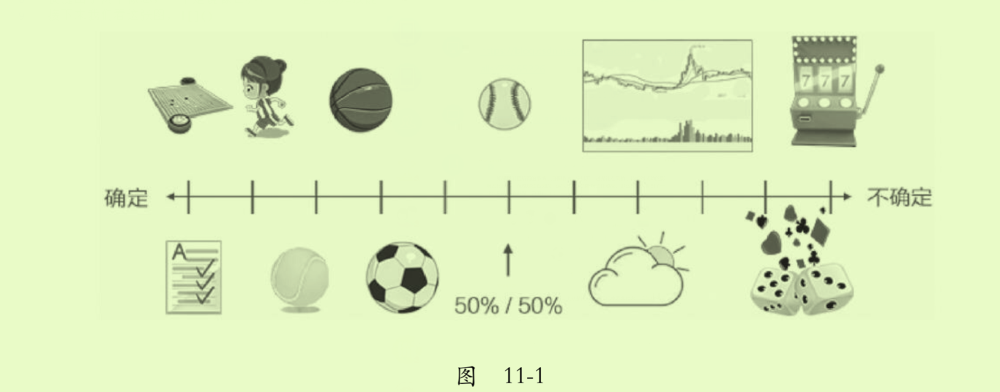
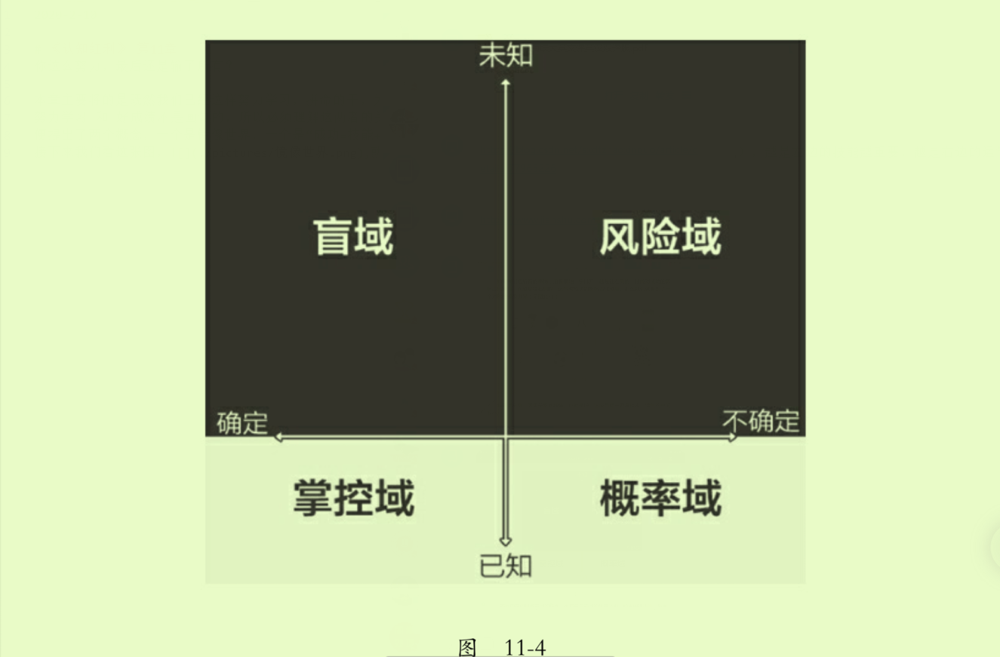

2020-2-10

# 《认知红利》 第11章
你这么努力，最后还是输了所有？

本章主要将的是既然我们已经这样努力学习，拼命的干，为什么输的还是自己呢？  
努力学习 和 好成绩不是画勾的，所以必须理解这两者的关系。  
便提出了两个概念，一个是镜像世界，一个是“成功=技能+运气”，  
接下来我们看这张图，,就是我们生活的世界，他不是一成不变的，（都有技能和运气），越是左边的技能越重要，越是右边的运气越重要。  
我们看一下这张图  

从而发现，不是因为你努不努力，而是你用错了技巧，一个数学解答题，叫你使用特定的知识点，比如使用勾股定理求第三边，但是你却拿出了尺子来测量，这样老师肯定不会给你分数。自然，从这张图可以看出，从小到大你所学习的都是掌握域的能力，自然在其他的领域中使用，必定是无法成功的。  

# 区域
## 掌握域  
顾明思义，就是你对事物会有比较高的掌握能力，你知道里面的运作规律。  
在掌握域的生存策略：积极努力，刻意练习，提高技能水平    
## 盲域
盲域就是这里有东西，但是你自己看不清楚  
在盲域的生存策略：承认自己的无知，并开始学习和探索  
## 概率域
一个既陌生又熟悉的环境，不确定性>确定性，运气成分更多  
薛定谔方程  
在概率域的生存策略：不赌单次，赌整体，善用数据决策  
## 风险域  
在这里，不仅结果不确定，就连结果会是什么都不确定  
在风险域生存策略：1、避免进入 2、增加冗余备份 3、彩票思维 （小收益大）  

# 统一的生存法则
守株待兔，株 表示的是那些不变的东西，兔 则是不确定的机会  
## 怎样才能守住自己的兔子
1、发展有效人脉，所谓人脉不是能帮助你的人，而是你帮助到他的人。  
2、学习跨接知识，多学习一些跨界知识，除了能打造多维能力之外，还能让你在整个知识大厦中建立各种“线头”。  
3、投资成长性资产，小而分散。 