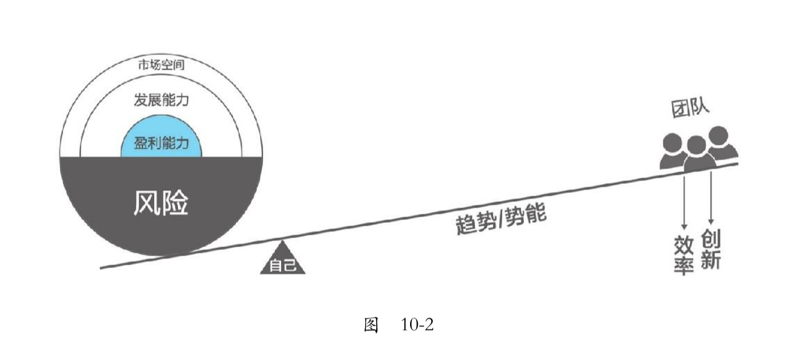

2020.2.9

# 《认知红利》第10章
## 我有一个改变世界的想法，可行吗？
现在自己所面临的问题是，我自己有一个想法，就说我这个想法能否给自己带来利益。  
然后针对这个问题做出了，研究，主要就是怎样去判断自己的这个想法能否给自己带来利益，所以需要对这个想法进行价值估计。  

晚上想法千万万，明早起床都不算
### 怎么估计？  
提出：为“想法”估值的四个维度  
- 估值维度一：客户终生价值  

>就是客户着你这里一辈子会花多少钱{客户终生价值=(客单价-边际成本)*购买次数}，这里有是三个概念，
1、 客单价  
一个客户在你这里购买一次产品或者服务，平均需要花多少钱？  
2、边际成本  
每多增加一个客户所增加的成本  
3、购买次数  
一个客户一辈子在你这里平均会消费几次  

- 估值维度二：获客成本  
>就是对项目“发展能力”的评估，就是获得一个付费客户所需要花费的成本  

- 估值维度三：用户规模  
>就是你的这个项目，最多可以获得多少用户，这是你要面临两个问题：
1、市场总容量    
2、市场竞争  

- 估值维度四：风险成本  
>就是在这个过程中，需要承受的风险是否是自己能够承受的。  

### 总结
把一个好想法变成一道作文题；再把一道作文题，变成一道解答题；再把有一道解答题，变成一道实验题；再把实验项目公开，让大家一起为你添砖加瓦。