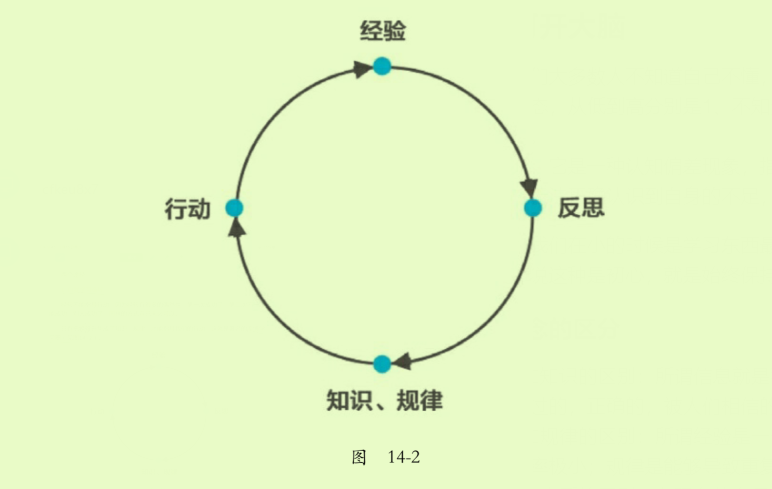

2020-2-15

# 《认知红利》 第十四章
人工智能在学习，而你却在刷朋友圈

本章主要讲的是如何学习？如何给自己的大脑建立一个图书馆？
作者从人工智能的崛起开始说，为什么人工智能能够如此火，大概的意思就是设计好算法，输入大量的知识。我们如果想要达到那样的结果，也需要学会如何学习，学习学习的方法，然后在学习知识。  

## 那我们该如何学习
把大象放进冰箱需要三步，我们学习知识要需要三步，这个知识类别前面的大象。即打开大脑，放入知识，提取使用。  

### 一、打开大脑
现在的我们大多数人不知道自己不懂，现在自己问自己，你现在有多少的问题可以百度。人一共有四种认知状态，从低到高分别是1、不知道自己不知道 2、知道自己不知道 3、知道自己知道 4、不知道自己知道。
达克效应：它是一种认知偏差现象，指的是能力欠缺的人在自己欠考虑的决定的基础上得出错误结论，但是无法正确认识到自身的不足，辨别错误行为。  

我们知道我们在小的时候是学习东西最快的，那个时候不懂的都会想办法，不管是放在嘴里，还是怎样。书中说这种是初心，就是始终保持学习的状态。

#### 几个概念的区分
1、信息和知识的区别：所谓信息就是我们所有接触的，听到的，看到的，闻到的。所谓知识是指那些被验证过的，正确的，被人们相信的概念、规律、方法论。
2、经验和规律的区别：所谓经验是一个人的结合自身总结的一些看法，是么有办法重现的，或者说重现的概率极小；规律是能够导致重复成功的因果关系。 
3、优质和劣质的区别：在现在信息量过大的世界，信息是区分好坏的。

### 二、放入知识
只有把经验升华成知识、规律，才能指导我们的行动。（库伯学习圈：xxx提出的自己的经验学习模式即经验学习圈理论）

#### MECE法则拆解、组装
MECE，试试Mutually exclusive collectively exhaustive,中文意思是“相互独立，完全穷尽”，也就是对一个重大的议题，能够做到不重叠，不遗漏的分类，而且能够借此有效把握问题的核心，并解决问题的方法、

### 三、提取使用
打开大脑，放入知识，形成结构、
要过好一生，你得使用好知识、
知识“没有用”，是因为你没“用”；不是因为你“没用”，而是因为你没“用”。

