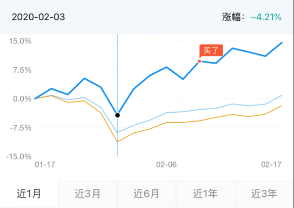

# 问题总和

1、什么是7日年化？

2、问：加入周五（2020-2-14）三点前买入基金，但是是在下周一（2020-2-17）确认受理，受理是按照那天的净值购入？

3、问：基金定投，比如我2020-2-12定投某只基金，选在定投周期后，比如选择下一天（2020-2-13）第一次定投，2-13号三点前定投扣款成功，是按照那天的净值计算？

4、自己的进厂选择？什么时候进场？

5、基金定投中的心态问题

我最早定投的时候，是在2020-2-10号，当时看见2-3号大跌，后面连续涨了好几天，这个时候估计，估计心里就有些不平衡了，想着为什么我不能找点了解到定投这件事情。
但是我想说明的是，这样的心态是有问题的，基金定投是一个长期的事情，不是看那一次自己上次是最对的。

